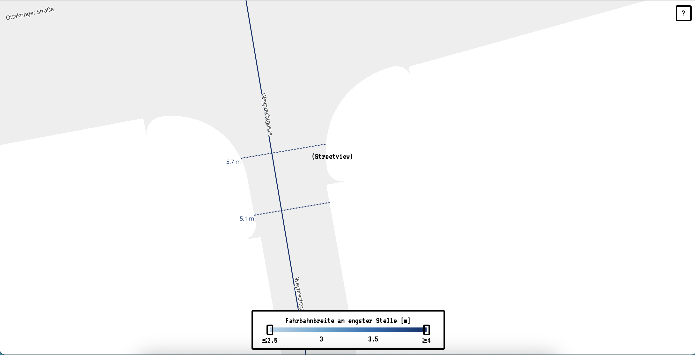

# Wie breit sind Wiens Fahrrad-Einbahnen?

Berechnung und Visualisierung der (befahrbaren) Fahrbahnbreite von nicht für Fahrräder geöffneten Einbahnen in Wien.

Datenbasis ist die Flächenmehrzweckkarte (FMZK) der MA 41 und der GIP-Straßengraph.

Weitere Infos im [Blogeintrag](https://elias-gander.github.io/2025-todo-wie-breit-sind-wiens-fahrrad-einbahnstrassen).

[Demo](https://elias-gander.github.io/data-visualization/wie-breit-sind-wiens-fahrrad-einbahnstrassen)

## Setup

1. Repo clonen

2. Virtuelles Python-environment erstellen und aktivieren

   1. Im Terminal zum Root-Folders des Repos navigieren
   2. `python -m venv ./venv`
   3. `source venv/bin/activate`

3. Benötigte Python Packages installieren: `pip install -r requirements.txt`

4. `python download-fmzk.py` ausführen und [GIP-Dataset](https://www.data.gv.at/datasets/3fefc838-791d-4dde-975b-a4131a54e7c5) (mehr Infos in _notebook.ipynb_) herunterladen und in _datasets_-Folder ablegen

5. Alle Zellen des Jupyter-Notebooks (notebook.ipynb\_) ausführen

6. Interaktive Kartendarstellung starten

   1. Im Terminal in den _web_-Folder navigieren
   2. `python -m http.server`
   3. Im Browser zu _http://localhost:8000_ navigieren
